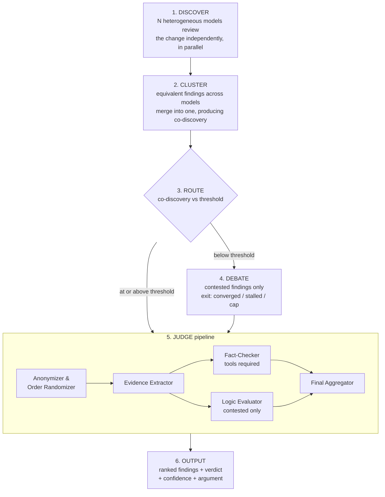

# Pipeline stages

The v1 slice, stage by stage. Cited by CAP-1 through CAP-6 in `SPEC.md`.

## 1. DISCOVER

N heterogeneous, cheap-to-mid-tier models review the change independently and in parallel. No model sees another's findings. Heterogeneity is the recall mechanism: correlated blind spots come from shared training data, so diversity of provider and family is the point, not diversity of prompt.

Models arrive by role resolution from the host (`host-integration.md`); MAD names none of them. Each finding carries a severity on a fixed scale from the model that raised it.

**Lens slots (CAP-11) are an optional second, additive pass over the same change**, each carrying a persona that narrows what it looks for. They are off by default. A lens finding enters the pool marked `lens-sourced` and claims **no co-discovery prior** — it was prompted for its dimension, so it has no unprompted signal to report. It reaches the judge in *verify-independently* mode below unless its severity is critical. Lens slots never count toward roster diversity, and the lens is stripped from everything downstream of this stage (AD-17).

Records which models answered. That count is the denominator for every co-discovery fraction downstream, and it counts **pool models only**. A model that times out or errors gets one retry, then the run proceeds with a warning naming it. If the host resolved the discovery roles to fewer distinct models than slots requested, the run is reported as degraded.

The fan-out passes through the budget ledger's concurrency limiter (AD-15 amended) rather than starting every slot at once: pool slots and lens slots are one fan-out, so the peak is `slots + lenses`, and provider rate limiting must arrive as backpressure rather than as a drop-out warning naming a model that was working.

## 2. CLUSTER

Equivalent findings from different models (model 1's finding 1.2, model 2's 2.2, model 3's 3.1) collapse into one finding whose co-discovery count is the number of distinct models in the cluster. This is the pipeline's *identity* agreement event — distinct from *verdict* (is it real?) and *severity* (how bad?).

The weakest link in the design, and the field's taxonomy has no name for it. Over-merge erases a distinct bug; under-merge inflates three agreements into three lonely findings. Thresholds, counts, and priors are all hostage to it.

Validated against a hand-labelled fixture set of equivalent/distinct finding pairs, with over-merge and under-merge reported as **two separate rates** in CI. One fused accuracy number would hide which way it fails, and the two failures have opposite costs.

Built as a separable component: v2 instance memory is this same engine pointed at rejection history instead of at the current run.

## 3. ROUTE

Co-discovery fraction ≥ threshold → skip debate, go straight to judging. Below → debate. **Critical severity overrides the threshold**: a unanimous "remote code execution" claim is exactly the one worth arguing.

The threshold is tunable (e.g. ≥80%), not strict all-models unanimity. Skipping debate is not skipping scrutiny — it swaps debate-scrutiny for judge-scrutiny.

**A lens-sourced finding has no fraction to compare.** It claims no co-discovery prior (CAP-11), so there is nothing to place against the threshold: route it to verify-independently judging, or to debate if its severity is critical. Record that reason explicitly — an absent prior is not a below-threshold one, and treating it as one would smuggle back the zero-coercion AD-9 forbids.

## 4. DEBATE

Contested findings only, each its own small independent debate. Positions are discovered, never assigned — and a lens model argues here as its finding's **author**, on evidence, with its lens instruction out of scope (AD-17a). Carrying a lens into debate would convert a coverage bias into an assigned position. A finding dies **only when its author withdraws**; deniers alone cannot delete it, and neither does a weak defence. Silence is abstention, not death: an author that never answers leaves its finding standing for the judge to weigh. (Corrected 2026-08-26 — this line previously read "withdraws **or fails to defend it**", which story 5 froze out and `core/stages/debate.ts` never implemented.)

Three exits, all recorded — plus one non-exit that must not be confused with them:

| Exit | Trigger | Next |
| --- | --- | --- |
| converged | positions settled | judge |
| stalled | no position moved this round | judge, immediately — two models restating themselves is not progress |
| cap hit | **round** cap reached with the room still open | judge |

**Token-cap exhaustion is NOT the `cap` exit.** When the ledger refuses the next turn, the still-undecided findings get `unresolved { diedAtStage: "debate" }` and **no `exit` at all** — they are surfaced as degraded rather than sent down the normal judge path. The two are different facts and a reader must be able to tell "we argued to the round limit" from "we ran out of money": the first has a transcript and an exit, the second has neither. (Split out 2026-08-26 — this row previously read "round or token cap reached", conflating them.)

Detecting `stalled` requires per-round position and concession deltas — the same record the judge wants to read.

## 5. JUDGE

A pipeline of narrow specialists, not one authoritative model. Decomposition is what dissolves the expensive-lead-model premise: "does this cited line say what he claims?" is a small-model job.

| Stage | Contract |
| --- | --- |
| Anonymizer & Order Randomizer | Debaters become A/B/C in randomized order. Removes authority bias. Co-discovery count stays visible. **Lens identity is stripped here too** (AD-17b) — "the Security Sentinel claims" carries exactly the authority this stage exists to remove. |
| Evidence Extractor | Pulls the claims and citations out of the transcript. Lossy and therefore dangerous — keeps pointers back to raw text, biased toward keeping too much. |
| Fact-Checker | Uses tools: opens the file, walks the path, runs the test. Where the token budget earns its keep. Outranks the Logic Evaluator. |
| Logic Evaluator | Rates argument quality. Advisory only. Contested findings only. |
| Final Aggregator | Produces the verdict from fact over logic. |

Two modes:

- **Adjudicate** — contested finding, arrives with a transcript. Full pipeline. Reads who moved, who cited, who conceded.
- **Verify independently** — threshold-skipped finding, arrives with no transcript and has never been challenged. Fact-Checker only; there is no argument to logic-evaluate. Here the judge is the finding's first and only skeptic.

*Clarified 2026-08-27 (story 6).* "Fact-Checker only" is exactly one billed turn, and it means the Fact-Checker also RULES: with no transcript there is nothing to extract, no argument to evaluate, and one input is not a panel to aggregate. Adjudicate is four turns — extract, then fact-check and logic-evaluate in parallel, then aggregate — and the Aggregator is the only place a verdict is written there. **Neither mode is stored anywhere:** it is derived from the record, because a `judgeMode` field would be a second source of truth one rename from disagreeing with the first.

*Amended 2026-08-28 (code review of story 6).* The derivation is `route` AND TRANSCRIPT EMPTINESS, not `route` alone: `argued = finding.route === "debate" && !transcript.empty`. A finding routed to debate whose room never produced a position — `exit: "stalled"`, reason `silent`, settled before the first round — arrives with no transcript, so there is nothing to extract and nothing to evaluate, and it takes the one-turn path like any other unargued finding. This is still a derivation from the record rather than a stored field; it reads two of its fields instead of one. The Adjudicate row of story 6's matrix already said "transcript present", so the code follows the matrix and this sentence was the thing that had drifted.

*Also 2026-08-27 (story 6).* Three things this table does not say and the stage does:

- **An author's withdrawal costs nothing.** Debate records a withdrawal as the author's own position and exits `converged`; the judge reads that and writes `withdrawn-by-author` with no model turn at all. Fact-checking a claim its own author has dropped buys nothing.
- **A fact-check that used no tools is recorded as UNVERIFIED**, in the finding, in the aggregator's own prompt, and in a degradation warning — and the run still completes. AD-13 forbids refusing the run; it does not permit presenting a reasoning-only check as a check.
- **The judge is not batched.** Four turns per contested finding is the price of the decomposition. `cost-model.md` lists no batching lever here, and lever 1's stated risk — one bad answer corrupting many findings at once — is worse in the stage that writes the verdict than in the one that argues.

## 6. OUTPUT

Findings ranked by confidence. Each carries three separate numbers, never fused:

- **co-discovery** — how many models raised it unprompted, over how many answered. A lens-sourced finding renders *not applicable — lens-sourced*, never `0` and never `1/1`
- **verdict** — upheld / withdrawn by author / judge-ruled
- **evidence** — what was actually produced: line cite, trace, failing test, or nothing but assertion

Plus the argument that produced it, so the reviewer can check the reasoning rather than trust a score.

Severity is carried through from discovery for triage — never adjudicated.

A separate **unresolved — you decide** section holds findings the budget ran out on, each with the evidence it accumulated and the stage it died at. Alongside them go any degradation warnings: models that dropped out, or a discovery roster that was not heterogeneous.
